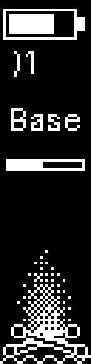
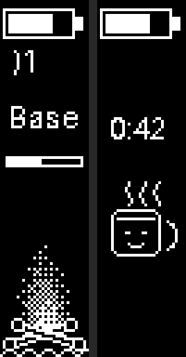
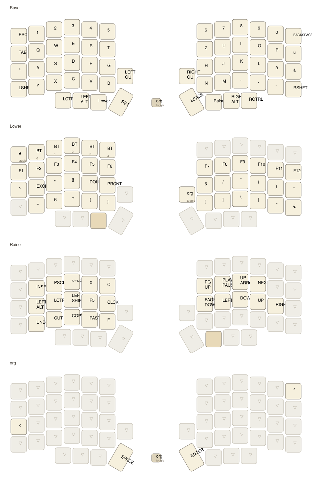
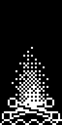

# my lily58 keyboard confic

ZMK config for my wireless Lily58 — nice!nano v2 compatible controllers and 128x32 OLED displays (mounted portrait), built from the [ergomech sandwich kit](https://ergomech.store/shop/lily58-sandwich-style-10).

The displays show a little fireplace. After half an hour of typing without a real break, a steaming mug takes over and gently tells me to stretch for a minute.

<p align="center">
  
  &nbsp;&nbsp;&nbsp;
  
</p>


## keymap



Four layers: **Base** (German QWERTZ), **Lower** (F-keys, numbers, symbols, BT profiles) and **Raise** (navigation, media, clipboard) on the thumb holds, and an **org** layer for spacemacs — press both thumb keys (Lower + Raise)

The picture above is generated from the actual keymap:

```sh
scripts/draw-keymap.sh
```

([keymap-drawer](https://github.com/caksoylar/keymap-drawer) via `uvx`, nothing to install - styling lives in `keymap-drawer/config.yaml`, loosely after the tikz drawing in my org notes.)

## building

Everything builds locally, only docker needed:

```sh
scripts/build.sh          # left + right      -> firmware/*.uf2
scripts/build.sh left     # just one half
scripts/build.sh reset    # settings-reset firmware
scripts/build.sh all      # everything
scripts/build.sh pristine # clean rebuild
```

The first run pulls the toolchain image and the zephyr workspace (~2 GB, once, gitignored). GitHub Actions builds the same thing on push, in case I'm not at my machine.

## flashing

```sh
scripts/flash.sh left     # double-tap RESET on the left half when asked
scripts/flash.sh right
scripts/flash.sh both
```

The script waits for the `NICENANO` drive to appear, copies the firmware, and the board reboots itself. If the two halves ever stop talking to each other: `scripts/flash.sh reset` on **both** halves, then flash left and right again ([why](https://zmk.dev/docs/troubleshooting/connection-issues)).

## display animation

The animation frames and the mug are generated:

```sh
python3 scripts/gen_display_art.py   # frames -> config/src/, previews -> assets/
```

Play with the flame simulation (cooling, turbulence, size) or draw a
different mug, re-run, rebuild. Previews:

<p align="center">
  
  &nbsp;&nbsp;&nbsp;
  
</p>

Behaviour knobs go into `config/lily58.conf`:

```ini
CONFIG_FIREPLACE_FRAME_MS=150        # animation speed
CONFIG_FIREPLACE_WORK_MINUTES=30     # typing time before the reminder
CONFIG_FIREPLACE_BREAK_SECONDS=60    # how long the mug stays
CONFIG_FIREPLACE_RESET_IDLE_SECONDS=60  # a real break resets the timer
CONFIG_FIREPLACE_PAUSE_REMINDER=n    # or turn the reminder off
CONFIG_FIREPLACE_IDLE_FREEZE=n       # keep burning while idle (battery!)
```

## ZMK Studio

The left half still speaks [ZMK Studio](https://zmk.studio) over USB for live keymap changes — unlock is on the Lower layer (Esc position).
